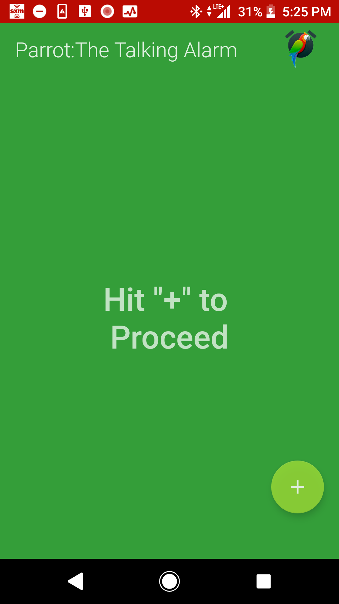
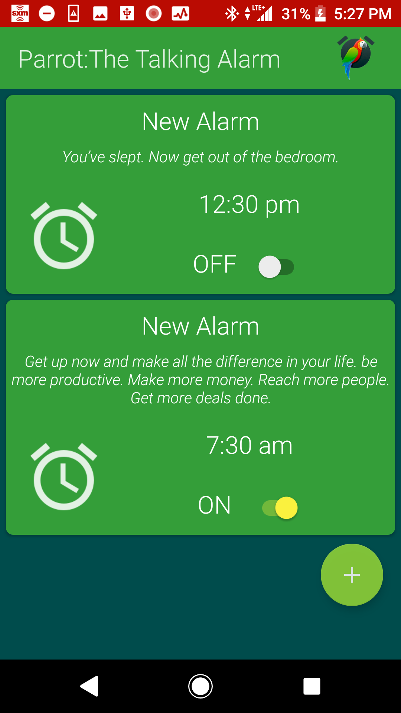
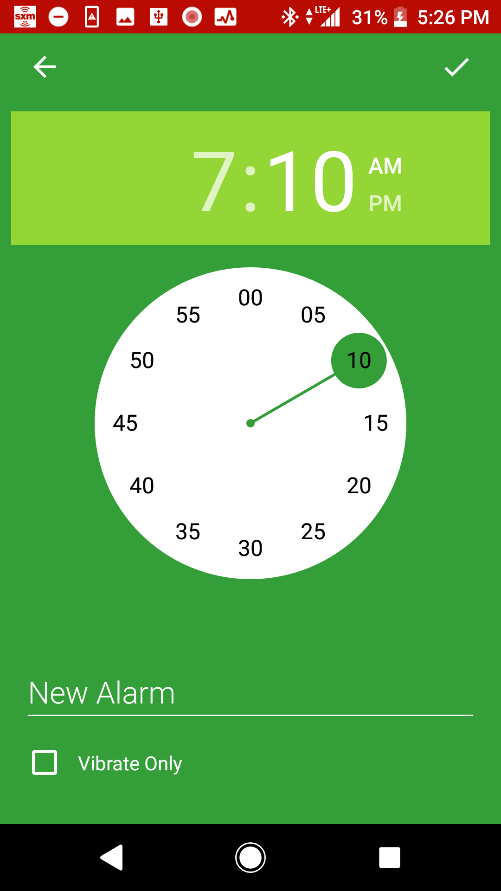
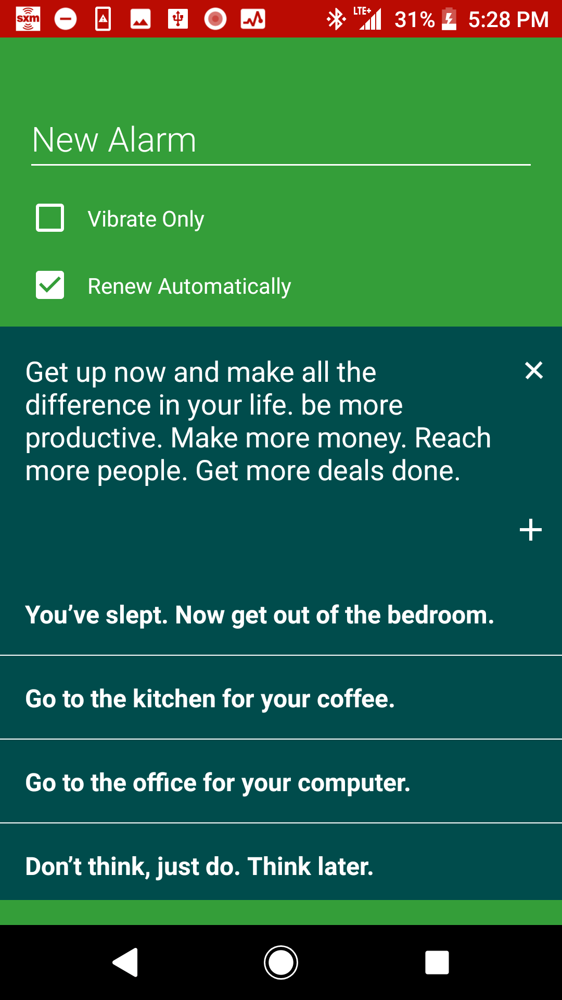
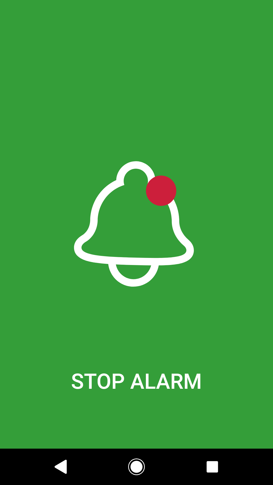

# Parrot: Wakes you up!

**[Download APK](https://github.com/RockLobstre/Parrot/blob/master/parrot.apk?raw=true)**

## Topics
* [What is Parrot?](#what-is-Parrot)
* [Software Architecture Diagram](#software-architecture-diagram)
* [Project APIs/Concepts](#apis-and-architectures-used)
* [Learning Sources/Inspiration](#sources-and-inspiration)
* [Contact Me](#contact)
* [License](#license)

## What is Parrot?

Parrot is a Talking Alarm App which allows the user to set up to 5 Daily Reminders containing a Reminder Message that is Spoken when the Alarm is triggered. Also, the user can search through inspirational built-in Reminder Messages such as "You’ve slept. Now get out of the bedroom.", "It's time to Drink water!" or "Get up early and have breakfast, which really is the most important meal of the day!".

I used TextToSpeech Library for the Talking Feature.

I'm applying Clean Architecture Principles, as well as Dagger 2 for Dependency Injection, RxJava 2 for Concurrency/Communication, Retrofit for Web Services and a Realm Database to store the Reminders. for walking me through Clean MVP Architecture.

### AlarmList Component

### AlarmDetail Component

### AlarmReceiver Page Component

### Settings  Component

## Issues
- AlarmReceiver Component sometimes behaves unexpectedly. At this point, I'm considering releasing the wakelock/alarm the moment onPause() is called, just to avoid crashes and issues releasing the Wakelock.

## Software Architecture Diagram

## APIs and Architectures Used:
This project is greatly inspired by Clean Architecture Principles. Now that I'm more comfortable with RxJava and Dagger 2, I'm confident that I'll be able to execute a modular and highly testable Application on the Android Platform. This project is an attempt to make that idea into an Open Source App.

**Architecture patterns:**
* Model View Presenter (Passive View). Keep Views dumb and simple, so that they don't need to be tested much, if at all (I may write some Espresso Tests, but it isn't high on my priority list).
* Clean Architecture. To complex to summarize in a few sentences; but the basic idea is having three layers of an Enterprise App (Presentation, Domain (Use Case), and Data (Service) layers). This seperation does increase the number of Classes, but the advantage is in simplicity, testability, and modularity to name a few.
* Dependency Injection Layer. This Layer satisfies creation of Dependencies (such as ReminderService.java) so that each part of the App has what it needs, when it needs it. This also decouples Object creation from Classes which shouldn't really be creating Objects in the first place (Seperation of Concerns).

* Dagger 2. D.I. Framework which I use to Inject Presenters, as well as to Inject Objects into my Service Layer.
* RxJava/RxAndroid 2 for concurrency. Rx allows me to create Data Streams which change over time, based on what happens in each Layer.
* Mockito to help with Unit Testing
* Realm for storing Reminders
* Retrofit for calling web APIs
* Plenty of System Services Like Vibrator, AlarmManager, MediaPlayer, PowerManager.WakeLock

## Sources and Inspiration

Fernando Cejas' Repository and material on Android and Clean Architecture was very useful to me. Being able to see working code is one of the greatest resources, and although I do many things differently (differently, not necessarily better), I don't think I would attempted this without such an awesome reference!

https://github.com/android10/Android-CleanArchitecture

Uncle Bob (Robert C. Martin) explains Clean Architecture in a very practicle and Framework Independent way. You'll want to listen when he speaks on Software Architecture :).

https://www.youtube.com/watch?v=Nsjsiz2A9mg&t=1832s

Martin Fowler eventually broke MVP Architecture into two sub-styles. I currently try to employ "Passive View" as best I can

https://martinfowler.com/eaaDev/PassiveScreen.html

Donn and Kaushik from Fragmented Podcast did an episode on Clean, which also helped my understand a fair bit. Also these guys do an awesome podcast so you should watch it anyway:

http://fragmentedpodcast.com/episodes/11/

## Contact:
It's my personal goal to create high-quality content, I'v been writing quality apps for almost 5 years and I passionate myself for what I do, and I'm glad if you would like to work with me.

- [Gmail](mattinn91@gmail.com)(rocklobstre@gmail.com)

## License
 * Copyright 2017, The Android Open Source Project
 * 
 * Licensed under the Apache License, Version 2.0 (the "License");
 * you may not use this file except in compliance with the License.
 * You may obtain a copy of the License at
 * 
 *      http://www.apache.org/licenses/LICENSE-2.0
 *
 * Unless required by applicable law or agreed to in writing, software
 * distributed under the License is distributed on an "AS IS" BASIS,
 * WITHOUT WARRANTIES OR CONDITIONS OF ANY KIND, either express or implied.
 * See the License for the specific language governing permissions and
 * limitations under the License.
 *
